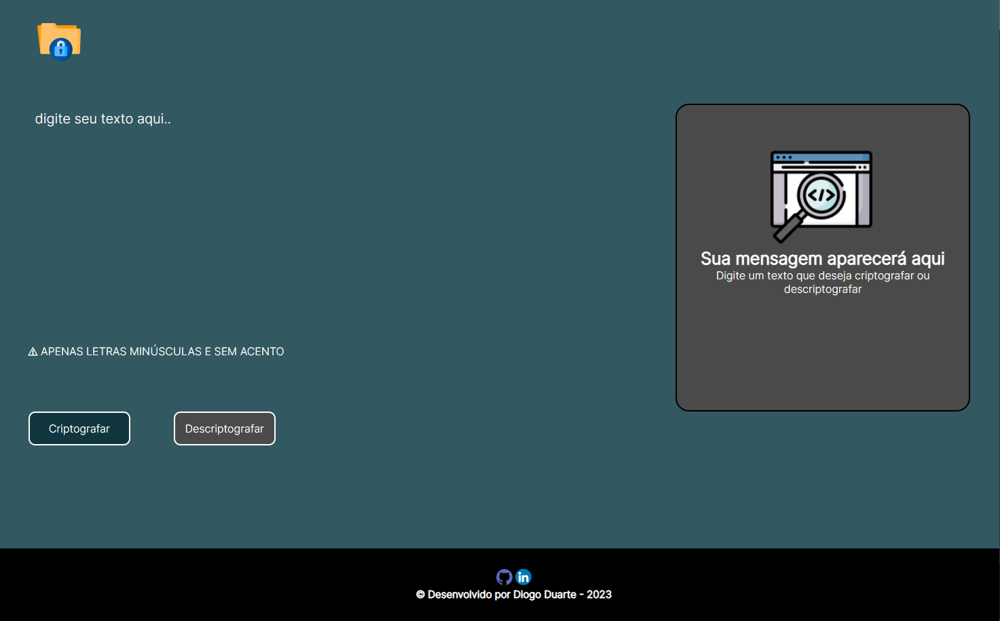
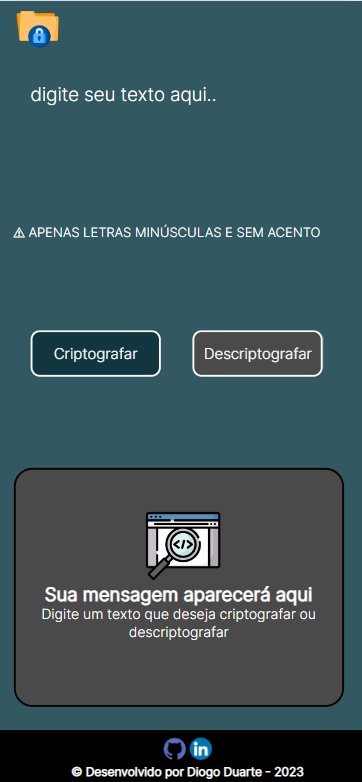
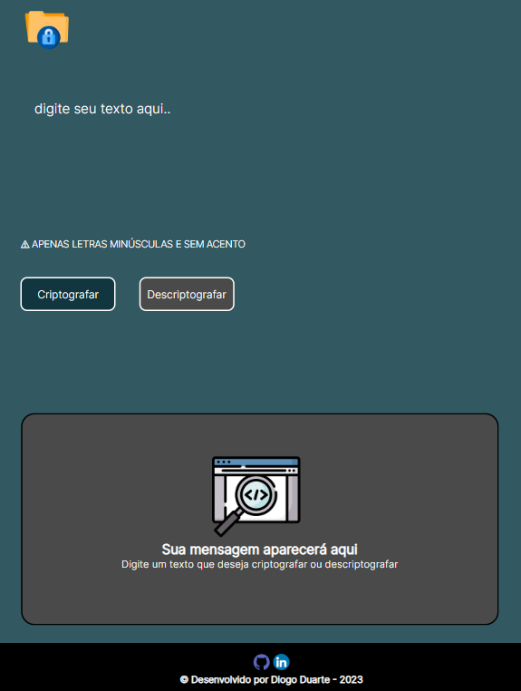

  <h1>Projeto Criptografador</h1>
  
Desafio Alura Challenge - JS/HTML/CSS  
  Desenvolvido por Diogo Duarte.

# 🛠️ Sobre: 

## ⚙ Proposta do desafio: 

Desenvolver um criptografador de texto, na qual a lógica proposta da criptografia é a seguinte: 

A letra "e" deverá ser convertida para "enter"  
A letra "i" deverá ser convertida para "imes"   
A letra "a" deverá ser convertida para "ai"  
A letra "o" deverá ser convertida para "ober"   
A letra "u" deverá ser convertida para "ufat"   

E desenvolver uma descriptografia aonde a lógica seja o oposto  

Por exemplo:  
"gato" => "gaitober"   
"gaitober" => "gato"   

O usuário não poderá escrever com letras maiúsculas nem usar acentuações  

Tendo em vista a proposta do projeto, confira o resultado do meu projeto para o desafio! 😃  

Meu projeto no repositório on-line: https://duarterj.github.io/Criptografador/

## 🎯 Layouts do meu projeto: 

## Layout resolução Mobile:

## Layout resolução Ipad, Tablet:

